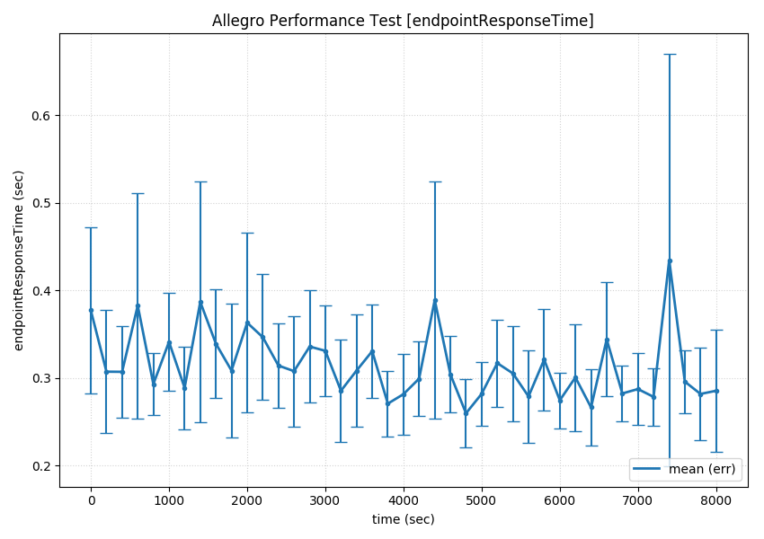
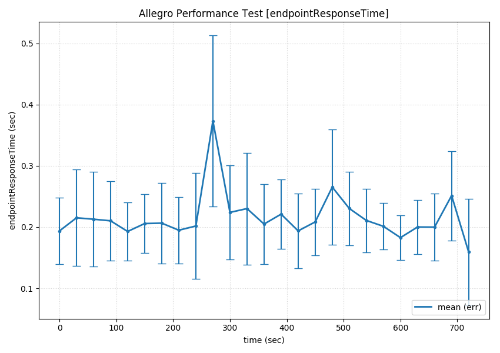

# Marathon performance test setup

This small project should visualize the performance measurements between the Marathon versions 1.3.12, 1.4.2 and current 1.5-SNAPSHOT.

# Test setup
The test was run on a Intel NUC skull canyon with a `Intel i7-6770HQ-2` CPU with SSD and 32GB of memory running ubuntu.

The Mesos setup contained 1 Mesos master and 5 Mesos agents, as well as 1 Marathon instance. Marathon had 6GB of heap reserved.

## Packaging
Marathon was packaged as jar/zip before running the test to be independent from sbt. For marathon 1.5 `sbt universal:packageZipTarball` was used and for marathon 1.4 and 1.3 `sbt assembly` was used. 

## Starting Marathon
Marathon 1.5 was started with `./marathon -J-Xmx6G -J-Xms6G --master 127.0.0.1:5050`, 1.4 with `java -Xmx6G -Xms6G -jar marathon-assembly-1.4.2.jar --master 127.0.0.1:5050` and 1.3 with `java -Xmx6G -Xms6G -jar marathon-assembly-1.3.12.jar --master 127.0.0.1:5050`.

## Starting Mesos
The Mesos cluster was started with the commands below:

```
alias mmaster="sudo /home/junterstein/workspaces/mesos/build/bin/mesos-master.sh --ip=127.0.0.1 --work_dir=/home/junterstein/runtimes/mesos/master --acls=file:///home/junterstein/runtimes/mesos/acls --credentials=file:///home/junterstein/runtimes/mesos/credentials"
alias mslave="sudo /home/junterstein/workspaces/mesos/build/bin/mesos-agent.sh --runtime_dir=/home/junterstein/runtimes/mesos/agent1-runtimedir --master=127.0.0.1:5050 --port=5051 --work_dir=/home/junterstein/runtimes/mesos/agent1"
alias mslave2="sudo /home/junterstein/workspaces/mesos/build/bin/mesos-agent.sh --runtime_dir=/home/junterstein/runtimes/mesos/agent2-runtimedir --master=127.0.0.1:5050 --port=5052 --work_dir=/home/junterstein/runtimes/mesos/agent2"
alias mslave3="sudo /home/junterstein/workspaces/mesos/build/bin/mesos-agent.sh --runtime_dir=/home/junterstein/runtimes/mesos/agent3-runtimedir --master=127.0.0.1:5050 --port=5053 --work_dir=/home/junterstein/runtimes/mesos/agent3"
alias mslave4="sudo /home/junterstein/workspaces/mesos/build/bin/mesos-agent.sh --runtime_dir=/home/junterstein/runtimes/mesos/agent4-runtimedir --master=127.0.0.1:5050 --port=5054 --work_dir=/home/junterstein/runtimes/mesos/agent4"
alias mslave5="sudo /home/junterstein/workspaces/mesos/build/bin/mesos-agent.sh --runtime_dir=/home/junterstein/runtimes/mesos/agent5-runtimedir --master=127.0.0.1:5050 --port=5055 --work_dir=/home/junterstein/runtimes/mesos/agent5"
```

## Restart between all tests
Between all test runs, marathon and Mesos was restarted and zookeeper data deleted.


# Test scenario
For this testing setup we use the following setup:

We do have 800 applications with each one running instance. We update N random apps every 30 seconds and measure the response time of `/v2/apps` every second over the entire test period. This is shown in the `response time` graph.

In the meantime we attach to the running Marathon process with a profiler and publish the `memory usage`, `cpu usage`, `thread count` and `memory footprint` graph.

# UPDATE December 2017

We found a major performance issue during the process of updating applications. Basically every deployment was affected by this issue.

## The issue

Every application without a configured port will get a random [service port](https://mesosphere.github.io/marathon/docs/ports.html#specifying-service-ports) assigned by marathon. This happens during the process of persisting the application(s) to zookeeper. During the storage of the root group, marathon will re-calculate the service port assignment for all applications with no manual assigned service port. Marathon will re-calculate all ports for all applications over and over again, even though marathon did this already. This calculation is deterministic, so it did not change the port assignments, but it wastes a lot of compute time.

## The fix
The fix is quite simple. Marathon stops re-calculating the random service port assignments after the first calculation. You can have a look at the fixes here:

- [master](https://github.com/mesosphere/marathon/pull/5787)
- [1.5](https://github.com/mesosphere/marathon/pull/5796)
- [1.4](https://github.com/mesosphere/marathon/pull/5816)


## The re-test
This improvement only affects the updating of applications, so the performance of initial deployment was not increased. But the performance increase during application updates was so big, that we decided to update 200 applications every 30 seconds. In comparison, the unpatched versions of 1.4 and 1.5 were not able to update more than 50 applications every 30 seconds.

### 1.5.4 including patch

### Profiler


### Response times of v2/apps in the meantime


### 1.4.7 including patch

### Profiler


### Response times of v2/apps in the meantime


# Marathon master (1.5-SNAPSHOT) of 2017-09-06

## Observations
The first test run was with 100 random applications which were restarted every 30 seconds. In this scenario Marathon was able to serve all deployments for around 10 minutes and then marathon started to respond with `HTTP response 500: {“message”:“GroupManager queue may not exceed 500 entries”}`, which indicates that Marathon gets too many new deployments and finished too few at the same time. Stopping the test which triggers new deployments leads to the state, that Marathon recovers and was able to operate normally after around 2 minutes. Therefore the test below updates 30 random application every 30 seconds.

## Deployment durations
### 800 applications with 1 instance each
- 62s to deploy 800 sleepy tasks
- 65s to deploy 800 sleepy tasks

### 500 applications with 1 instance each
- 34s to deploy 500 sleepy tasks
- 32s to deploy 500 sleepy tasks

## Additional test with `--disable-store-cache`
Marathon 1.4 and 1.5 are able to disable caching in the storage layer. If this cache was disabled Marathon was not able to store the initial POST request to store the initial 800 applications. Storing single application POST requests were processed normally.

## Graphs
### Profiler


### Memory sampler


### Response times of v2/apps in the meantime


# Marathon 1.4.7

## Observations
Same observations as seen on Marathon 1.5-SNAPSHOT.

## Deployment durations
### 800 applications with 1 instance each
- 62s to deploy 800 sleepy tasks
- 64s to deploy 800 sleepy tasks

### 500 applications with 1 instance each
- 35s to deploy 500 sleepy tasks
- 33s to deploy 500 sleepy tasks

## Graphs
### Profiler


### Memory sampler


### Response times of v2/apps in the meantime


# Marathon 1.4.2

## Observations
The test run was with 30 random applications which were restarted every 30 seconds. In this scenario Marathon was able to serve all deployments for around 3 to 5 minutes and then marathon started to respond with `HTTP response 409: {“message”:“App is locked by one or more deployments. ...”}` and/or `Futures timed out after [10000 milliseconds]` , which indicates that Marathon gets too many new deployments and finished too few at the same time. Stopping the test which triggers new deployments leads to the state, that Marathon recovers and was able to operate normally after around 3 minutes. In one run Marathon was not able to recover and responeded persistently with `HTTP 500: Futures timed out after [10000 milliseconds]`, compare [MARATHON-7400](https://jira.mesosphere.com/browse/MARATHON-7400).

## Deployment durations
### 800 applications with 1 instance each
- 75s to deploy 800 sleepy tasks
- 72s to deploy 800 sleepy tasks

### 500 applications with 1 instance each
- 43s to deploy 500 sleepy tasks
- 46s to deploy 500 sleepy tasks

## Graphs
### Profiler


### Memory sampler


### Response times of v2/apps in the meantime


# Marathon 1.3.12

## Observations
The first test run was with 100 random applications which were restarted every 30 seconds. In this scenario Marathon was able to serve all deployments for around 5 minutes and then marathon started to respond with `HTTP response 409: {“message”:“App is locked by one or more deployments. ...”}` and/or `Futures timed out after [10000 milliseconds]` , which indicates that Marathon gets too many new deployments and finished too few at the same time. Stopping the test which triggers new deployments leads to the state, that Marathon recovers and was able to operate normally after around 3 minutes. Therefore the test below updates 30 random application every 30 seconds.

## Deployment durations
### 800 applications with 1 instance each
- 60s to deploy 800 sleepy tasks
- 67s to deploy 800 sleepy tasks

### 500 applications with 1 instance each
- 40s to deploy 500 sleepy tasks
- 40s to deploy 500 sleepy tasks

## Graphs
### Profiler


### Memory sampler


### Response times of v2/apps in the meantime
